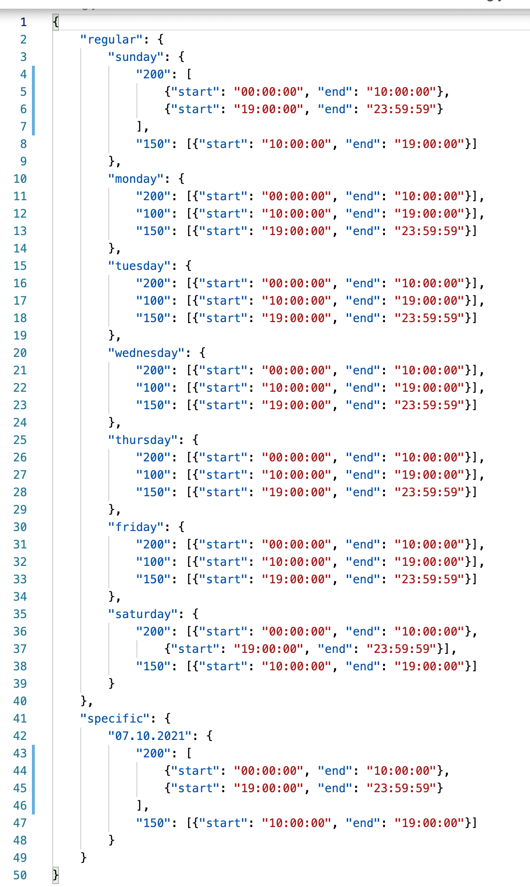
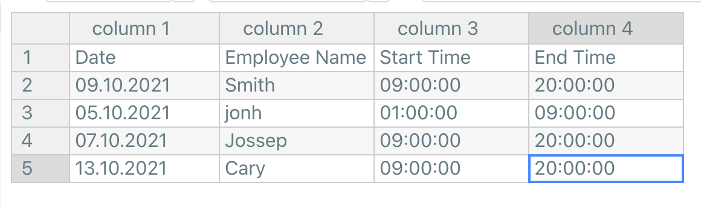
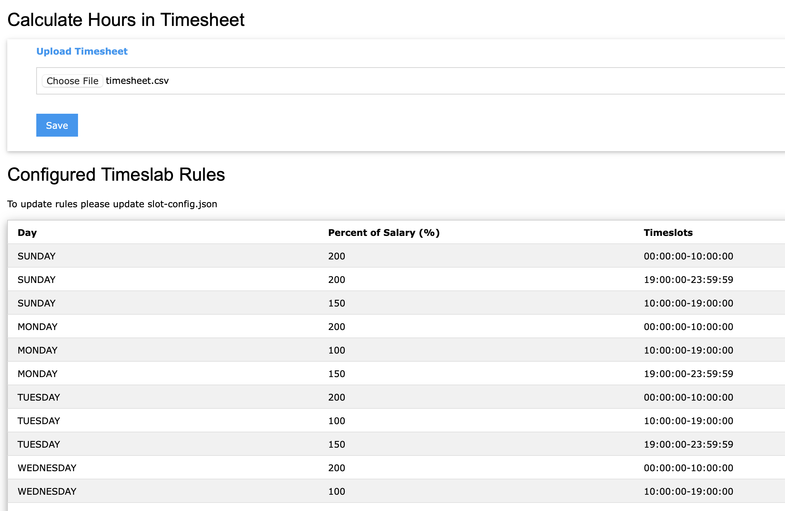
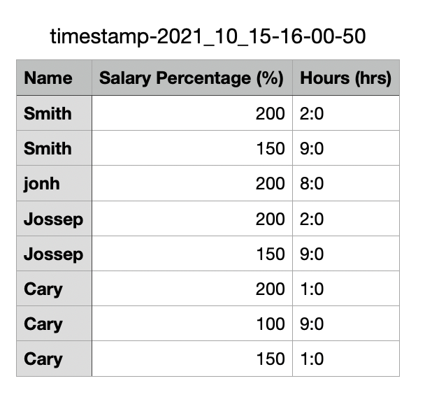

# Working Hours Calculation in Different Slabs

## Prerequsite
- **Install PHP**

## Configure
1. Slab Configuration: Here update salary percentage for a timerange. Regular is the weekly breakups for entire month. Specific is for date specific breaks for special dates like holidays. These slabs will be listed in landing page.



2. Upload Timesheet CSV: List of start time and end time of employees.



## Execute
1. Run project in php

```
php -S 127.0.0.1:8000
```

2. Open http://localhost:8000/ in any browser. 



Here in landing page configurated rules will be listed. To update these rule please edit <a herf="slot-config.php">slot-config.php</a>.

3. Upload updated timesheet


# Output
A CSV will be downloaded with working hours calculated in different slabs.



